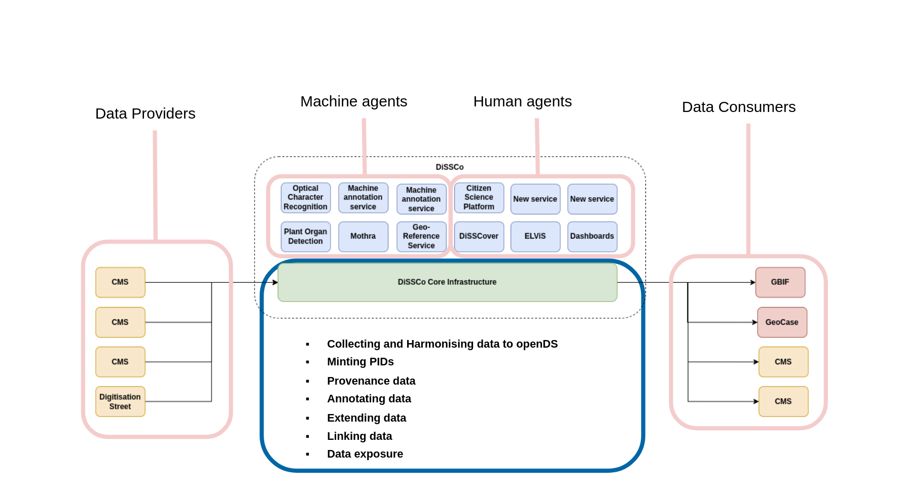

# DiSSCo Core Architecture

{: .no_toc }

- TOC
{:toc}

Before we can delve into how MASs connect to the DiSSCo architecture, it is useful to know how the
DiSSCo architecture operates.

As a platform, DiSSCo sits in between data providers and data consumers. The core architecture adds
value by harmonizing data to openDS, minting unique identifiers for specimens and media objects,
capturing provenance, and, of course, facilitating annotations. As DiSSCo improves the data, DiSSCo
will send this enhanced data upstream, back to the data providers, and downstream, to data
aggregators (though this functionality is currently in development).

Due to its flexible nature, additional services can be built on top of the DiSSCo core architecture.
A MAS is one such service. What a MAS does is essentially a "black box" from the DiSSCo
Architecture's perspective. A MAS receives a message as input and produces an annotation as an
output.

The DiSSCo position in the biodiversity data landscape is illustrated in the following diagram. On
the left, data providers send data to the core infrastructure. In the middle, machine and human
agents rest on top of the
core infrastructure, adding additional value. On the right, the enriched data is sent to data
consumers.

Other value services of DiSSCo:

- Harmonising data to OpenDS
- Minting Persistent Identifiers (PIDs) for resources
- Versioning objects and maintaining a provenance record
- Extending data and linking
- Exposing data through APIs, including a robust search function

# Machine Annotation Services

A Machine Annotation Service (MAS)  is an automated service that annotates a target in DiSSCo. Most
often, MASs are scheduled by a user on a specific target - either a digital specimen or a media
object -- either through the DiSSCover platform or programmatically through the DiSSCo API.

{: .note }
> When an existing service is adapted to work within DiSSCo, there are two components involved:
>
> - **Value Service**: This is the original service being adapted to DiSSCo. It is deployed on
    infrastructure separate from the core DiSSCo architecture, and should be accessible through
    APIs.
> - **MAS Middleware**: This is a lightweight component containerized and deployed on the DiSSCo
    core
    architecture.

## When a machine makes an annotation

The flow of data can be summarised below:

**1. The user requests a job**

Through the DiSSCover platform, a user schedules a MAS on a specific target. DiSSCover calls the
DiSSCo backend to schedule a job.

**2. The backend sends a message**

DiSSCo uses [Apache Kafka](https://kafka.apache.org/) as an asynchronous messaging service. When a
machine annotation is requested, a "job" is created. A UUID is generated and associated with this
process to track the state of the job. When it is first created, the job is marked as `SCHEDULED`.

The backend sends a message through Kafka. This message that includes the job ID and the target of
the annotation. The message has a topic that identifies the message's destination. Each MAS is given
its own unique topic by DiSSCo.

**3. The job is received by the MAS middleware**

Listening for a Kafka message on its topic, the MAS receives the message.

**3a. (Recommended) The MAS middleware informs the backend the job was received.**

It is strongly recommended that once the MAS receives the message, it informs the backend. This
improves user experience. The MAS sends the job id to the `/running` endpoint. The backend, in turn,
marks the job as `RUNNING` and informs the user.

**4. The MAS middleware calls the value service**
The MAS middleware extracts relevant information from the target and sends it to the value service,
usually through an API call. The results from the value service are formatted into an annotation
event.

**5. The results are sent to DiSSCo**
The MAS middelware sends the formatted annotation event through the `annotation` Kafka topic.

**6. The annotation is processed**
DiSSCo's annotation processing service picks up the message in the `annotation` topic and processes
it. The annotation is then available through the DiSSCo API and the DiSSCover interface.

**Congratulations! You've annotated an object!**

## MAS Deployment

The MAS middleware application is deployed as a container on the DiSSCo core architecture. The value
service will remain deployed where it was originally.

{: .note}
The MAS middleware is deployed on the DiSSCo network. If your value service requires whitelisting a
specific IP address, let the DiSSCo team know so they can provide your MAS middleware with a static
IP address. That way, the middleware may communicate with the value service. 

