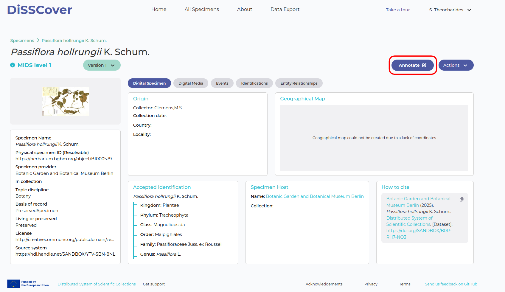
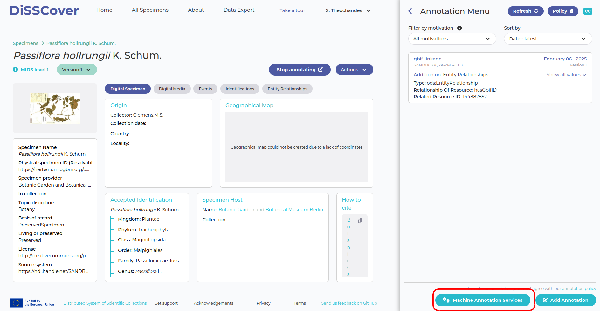
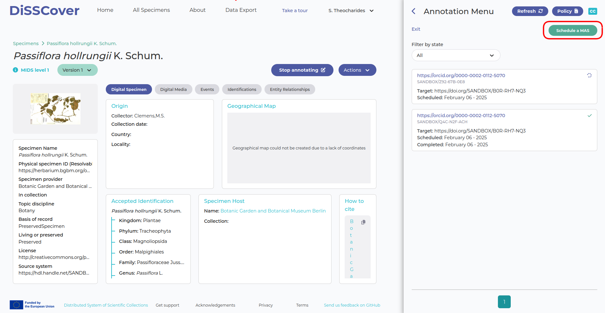
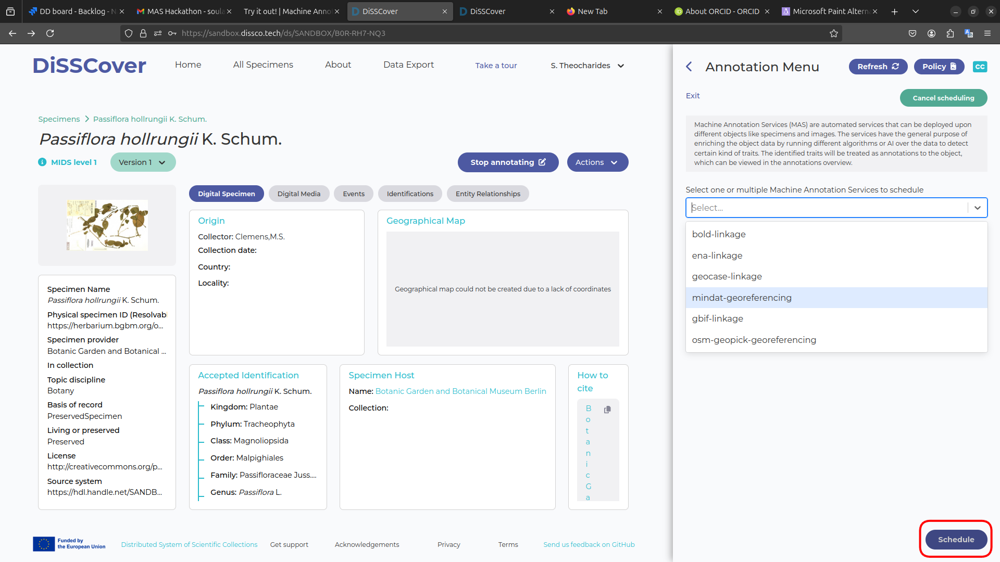
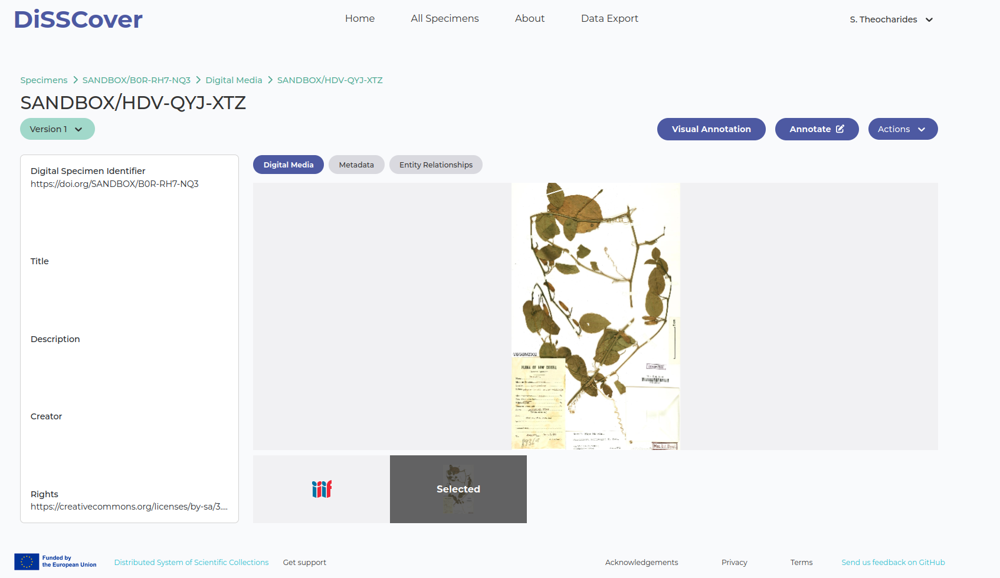

# Scheduling a MAS

You can schedule a MAS in 2 ways: programmatically, through the API, and manually through the
DiSSCover User interface.

{: .note}
Currently, there are no MASs available on the production environment. You may try out this feature
in the [sandbox environment](https://sandbox.dissco.tech/).

## Scheduling through DiSSCover

**1. Sign Up**

In order to create annotations through DiSSCo, you need to be logged in and have an ORCID associated
with your account. This allows DiSSCo to track annotation provenance and associate it with a user.
ORCIDs are free, globally unique identifiers for researchers and contributors. No
ORCID? [Register for one here](https://orcid.org/register)!

**2. Select a target**

Search for a specimen through the DiSSCover interface and find a suitable target. You may filter on
discipline, taxonomy, organisation, if the specimen has media, and many other parameters.

**3a. Annotate a Specimen**

When you find specimen you want to annotate, you will come to the specimen overview page:

To open the annotation menu, select the "Annotate" button (circled red in above image). This will
open the annotation menu.

Select the "Machine Annotation Services" button at the bottom, then "Schedule a MAS" on the top
left.

Select the MAS(s) you wish to schedule. The drop-down list of MASs will only show applicable MASs.
Click "Schedule" to schedule the selected MASs.

The MAS may take a few minutes to run. When complete, it will have a green check mark next to it.

**3b. Annotate a Digital Media Object**
If the MAS you want to schedule is designed for media objects, it won't come up in the digital
specimen overview. Instead, navigate to the "digital media" tab and click on the media preview to be
taken to the digital media page:

You can then schedule a MAS on the selected digital media by navigating to the annotate menu.

## Using the API

The DiSSCo Swagger endpoint specifies how the backend can be used to schedule a MAS on a target
programmatically.
See
the [/digital-specimen/{mas}](https://dev.dissco.tech/api/docs/swagger-ui/index.html#/digital-specimen-controller/scheduleMassForDigitalSpecimen)
and [/digital-media/{mas}](https://dev.dissco.tech/api/docs/swagger-ui/index.html#/digital-specimen-controller/scheduleMassForDigitalSpecimen)
endpoints for more information.

Note: in order to use the API to schedule MASs, you will need an authenticated token. Reach out to
the DiSSCo team for more information.